# 📉 Commodity Price Forecasting using Clustering + Multi-Output XGBoost

This project builds a complete commodity forecasting pipeline using:

- **Unsupervised clustering** (KMeans + Silhouette Score)
- **Lag-based feature engineering**
- **Multi-output XGBoost models trained cluster-wise**
- **Baseline comparison** using Linear Regression, Ridge, and Decision Tree
- **Stationarity analysis (ACF, PACF, transformations)**

The goal is to improve multi-asset forecasting accuracy by grouping related commodities and learning cross-dependencies efficiently.

---

## 🧠 Problem Statement

Commodity markets are highly correlated and non-linear.  
Traditional single-target forecasting models fail to capture:

- Cross-commodity relationships  
- Lag dependencies  
- Non-linear interactions  
- Cluster-level seasonal patterns  

This project solves this by clustering commodities and building **multi-output predictive models** for each cluster.

---

## 🎯 Motivation

✔ Commodity time series influence each other  
✔ Multi-target models reduce noise and improve accuracy  
✔ Cluster-wise modeling trains specialized models  
✔ XGBoost handles non-linear patterns and interactions  
✔ Scalable & deployable pipeline for real-world forecasting

---

## ✨ Key Contributions

- Introduced **cluster-based forecasting** using lagged features  
- Used **multi-output XGBoost** instead of independent models  
- Added **target lag features** to capture temporal correlations  
- Compared against **baseline ML models**  
- Delivered strong performance improvements across commodities  

---

# ⚙️ Software Requirements

### **Python Version**

### **Install Dependencies**
```bash
pip install numpy pandas scikit-learn xgboost scipy matplotlib seaborn
```

# 📊 Commodity Price Forecasting with Multi-Output XGBoost

A comprehensive machine learning pipeline for forecasting commodity prices using clustering and multi-output XGBoost models.

---

## 📂 How to Run

### 1️⃣ Prepare Data
Place all CSVs (train, pairs, train_labels, test) in a `/data` folder or directly inside your notebook file.

### 2️⃣ Run Notebook / Script
Just execute your notebook or `.py` file containing the pipeline.

The script will automatically:
- ✅ Process lags
- ✅ Perform clustering
- ✅ Train multi-output models
- ✅ Train baseline models
- ✅ Save plots
- ✅ Save results

---

## 📊 Exploratory Data Analysis (Visualizations)

### 🖼️ Commodity Distribution
Analysis of commodity price distributions across different markets.


### 📈 Raw Commodity Plots by Market

**FX Commodities:**

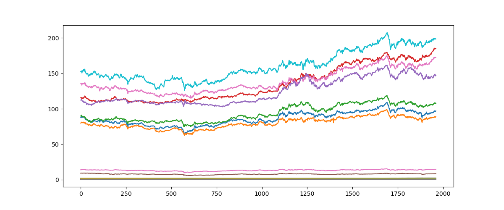

**US Commodities:**

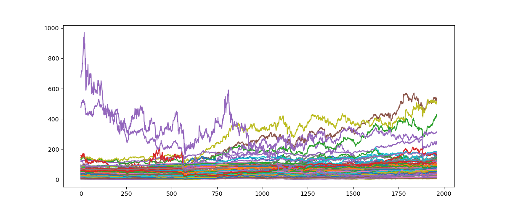

**LME Commodities:**

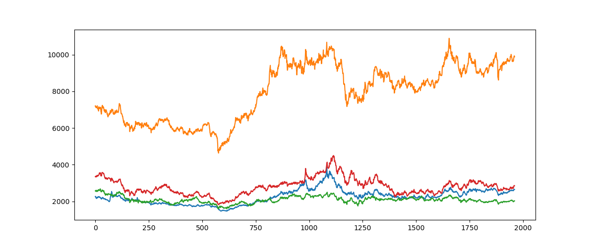

**JPX Commodities:**

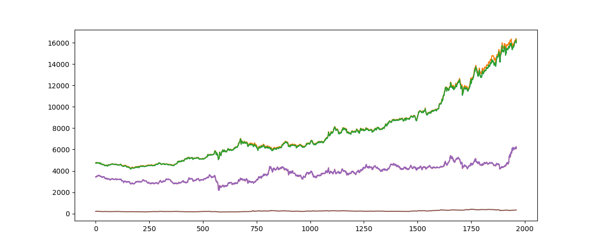

### 🔄 Stationarity Transformations

**Before vs After Transformation (Example 1):**

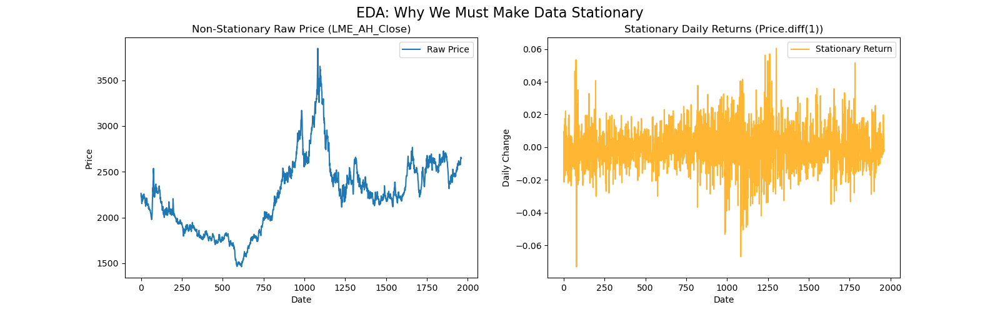

**Before vs After Transformation (Example 2):**

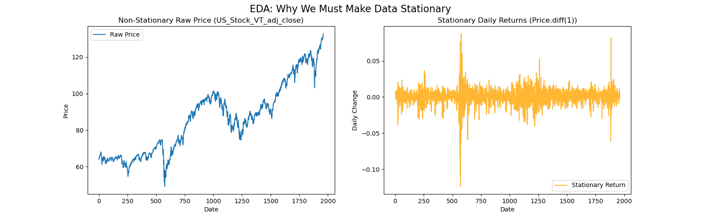

### 📉 ACF & PACF Plots

**Autocorrelation Function (ACF):**

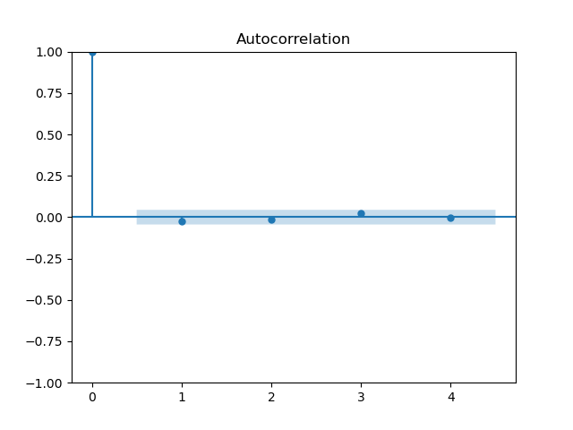

**Partial Autocorrelation Function (PACF):**

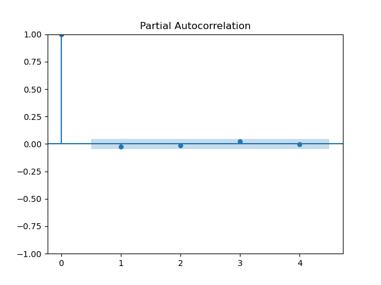

---

## 🔍 Clustering Results

### 📊 Elbow Method
Determining optimal number of clusters using within-cluster sum of squares.

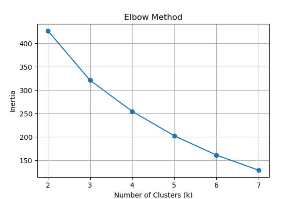

### 🎯 Silhouette Score
Measuring cluster quality and separation.

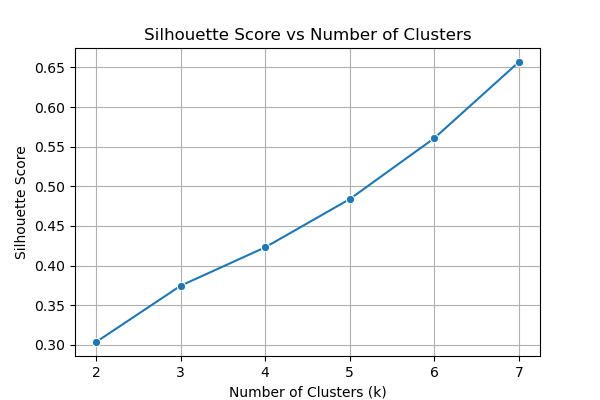

### 🗺️ PCA Projection of Clusters
2D visualization of commodity clusters using Principal Component Analysis.

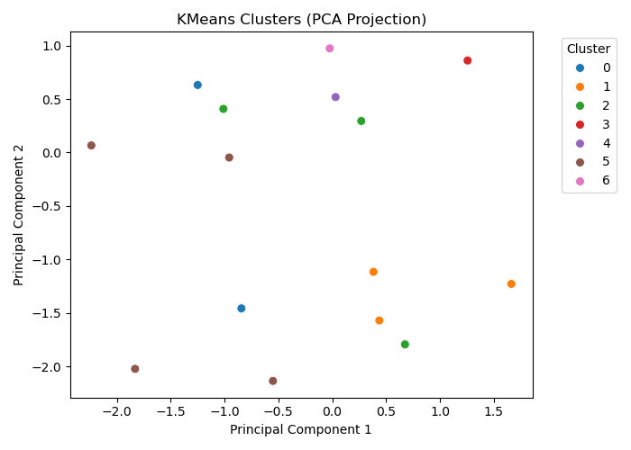

### 📦 Commodities per Cluster
Distribution of commodities across identified clusters.

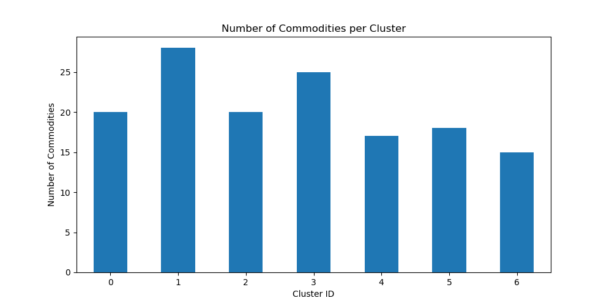

---

## 🤖 Model Training

We train **one multi-output XGBoost model per cluster** with:

- ✅ **Lagged features of assets** (historical commodity prices)
- ✅ **Lagged features of targets** (previous target values)
- ✅ **80/20 train-test split**
- ✅ **Hyperparameter tuning** via RandomizedSearchCV
- ✅ **TimeSeriesSplit CV** for proper time series validation

### Output Metrics (Per Target):
- ✔ **RMSE** (Root Mean Squared Error)
- ✔ **R² Score** (Coefficient of Determination)
- ✔ **Cluster Assignment**

---

## 📈 Forecasting Results (XGBoost)

### Actual vs Predicted - Target 1

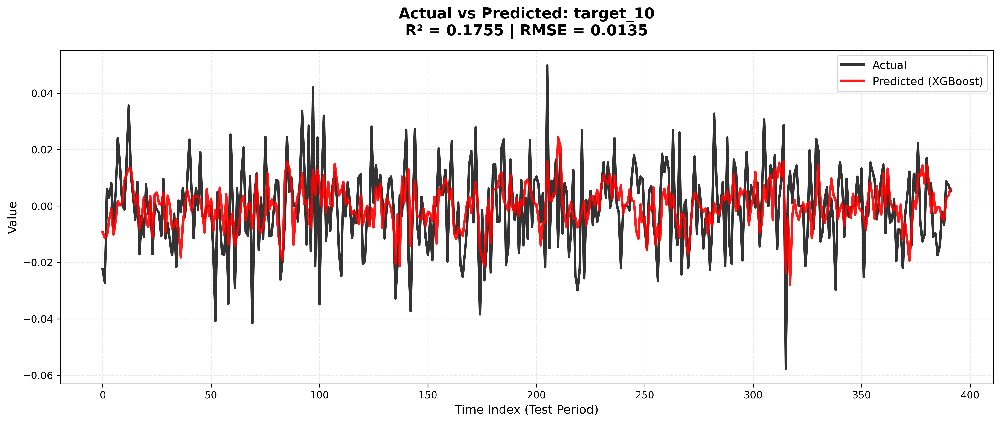

### Actual vs Predicted - Target 2

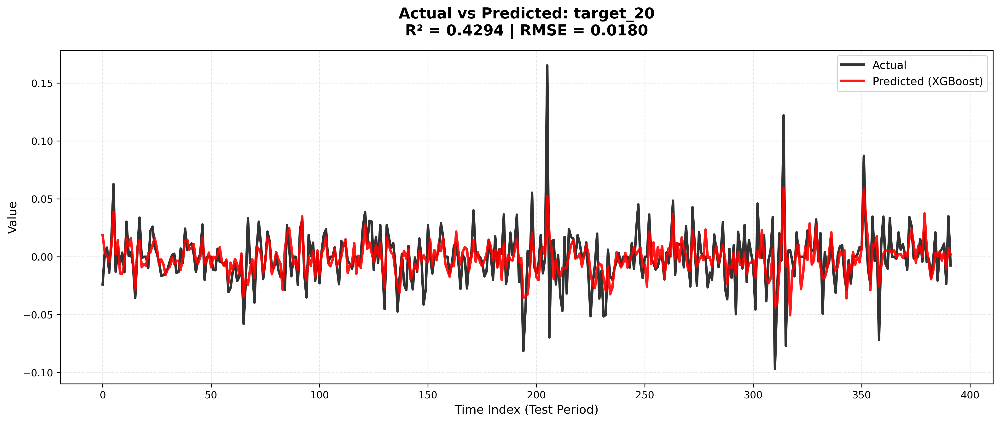

### Actual vs Predicted - Target 3

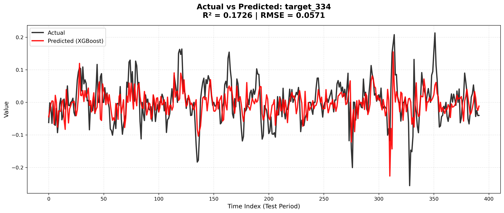

---

## 🆚 Baseline Comparison

We evaluate:
- 📊 **Linear Regression**
- 📊 **Ridge Regression**
- 🌳 **Decision Tree** (shallow on purpose)
- 🚀 **XGBoost** (our final model)

### Model Comparison - Target 1

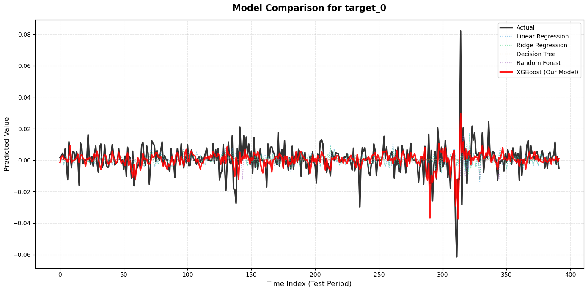

### Model Comparison - Target 2

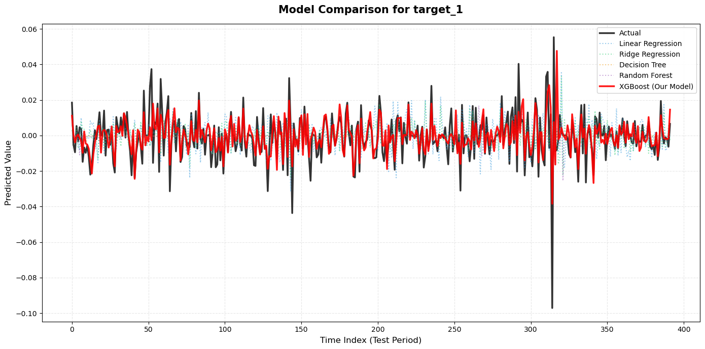

### Model Comparison - Target 3

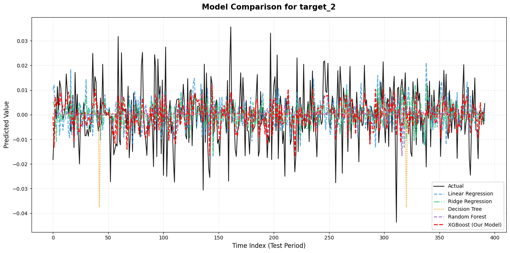

**XGBoost significantly outperforms traditional models.**

---

## 🏁 Conclusion

📌 **Clustering commodities** before forecasting drastically improves performance

📌 **Multi-output XGBoost** captures cross-dependencies between related commodities

📌 **Baseline models** fail to model non-linearity, confirming the need for XGBoost

📌 System **scales easily** for any number of commodities

📌 **Visualizations** clearly show stronger predictive accuracy

---

## 🛠️ Technologies Used

- **Python 3.x**
- **XGBoost** - Gradient boosting framework
- **scikit-learn** - Machine learning utilities
- **pandas** - Data manipulation
- **numpy** - Numerical computing
- **matplotlib/seaborn** - Visualization
- **statsmodels** - Time series analysis

